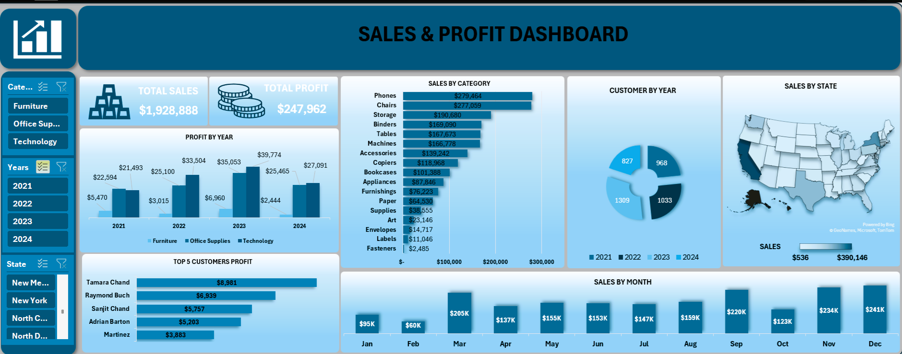

# 📊 Sales & Profit Dashboard  

  

Interactive dashboard built in **Excel** for analyzing sales and profit performance.  

This project provides an **interactive Excel Dashboard** for analyzing **sales and profit performance** across different years, product categories, customers, and regions. It helps in making **data-driven business decisions** by providing clear visual insights.  

---

## 📂 Dataset Description  

- **Total Sales:** $1,928,888  
- **Total Profit:** $247,962  
- **Years Covered:** 2021 - 2024  
- **Categories:** Furniture, Office Supplies, Technology  
- **Regions:** United States (state-level sales)  
- **Customers:** 4,137 unique customers  

**Data contains:**  
- Order Date  
- Customer Name  
- Category & Product details  
- Sales & Profit values  
- State-wise distribution  

---

## 📈 Dashboard Highlights  

### 🔹 Profit by Year  
- Highest profit achieved in **2023**: $81,787  
- Steady growth observed from **2021 → 2023**, followed by a slight dip in 2024.  

### 🔹 Sales by Category  
- **Phones:** $279,464 (highest sales)  
- **Chairs:** $277,059  
- **Storage & Binders** also performed strongly.  
- Low-performing items include **Fasteners ($2,485)** and **Labels ($11,046)**.  

### 🔹 Top Customers (by Profit)  
1. Tamara Chand → $8,981  
2. Raymond Buch → $6,939  
3. Sanjit Chand → $5,757  
4. Adrian Barton → $5,203  
5. Martinez → $3,883  

### 🔹 Sales by State  
- **California:** $390,146 (leading state)  
- **New York:** $246,518  
- **Texas:** $151,437  
- **Lowest Sales:** West Virginia ($536) and North Dakota ($892).  

### 🔹 Monthly Sales Trend  
- **Peak months:** December ($241K), November ($234K), September ($220K).  
- **Low months:** February ($60K) and January ($95K).  

---

## 📊 Visualizations  

- Profit by Year (stacked bar chart)  
- Sales by Category (horizontal bar chart)  
- Customer by Year (donut chart)  
- Sales by State (map visualization)  
- Top 5 Customers Profit (bar chart)  
- Monthly Sales (column chart)  

---

## 🚀 How to Use  

1. Open the **Excel file**  
2. Navigate to the **Dashboard tab**  
3. Use the slicers (**Category, Years, State**) to filter insights  
4. Explore **interactive charts** for better analysis  

---

## 🛠️ Tools Used  

- **Microsoft Excel** → Pivot Tables, Pivot Charts, Slicers, Dashboard Design  
- **Data Cleaning** → Done directly in Excel  
- **Visualization** → Excel charting with advanced formatting  

---

## 📌 Key Business Insights  

✔️ Technology and Office Supplies generated the **highest profits**.  
✔️ Sales peak during **holiday months (Nov-Dec)**.  
✔️ **California, New York, and Texas** are the strongest markets.  
✔️ Top 5 customers contribute significantly to profits.  
✔️ Certain products (e.g., **Fasteners, Labels**) are underperforming and may need review.  

---

## 📷 Dashboard Preview  

 

---

## 🔗 Author  

👤 **Muhiddin Axmadov**  
📌 *Aspiring Data Analyst | Dashboarding & Business Intelligence*  
